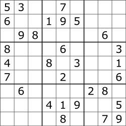

# Solving Sudoku Using Recursion and Backtracking

Sudoku is a logic-based number placement puzzle.  Given a partially filled in 9x9 grid, the goal is to assign digits from 1 to 9 to the empty cells so that every row, column, and subgrid of size 3x3 contains exactly one instace of each of the digits from 1 to 9.

If you want a more detailed explaination, read more about Sudoko at [Wikipedia](https://en.wikipedia.org/wiki/Sudoku)

An unsolved Sudoku puzzle:

  

and here it is, solved:

Sudoku can be solved using a **recursive backtracking algorithm**.

## What is a backtracking algorithm?

In backtracking algorithms, you try to build a solution one step at a time.  If at some step it becomes clear that the current path that you are on cannot lead to a solution, you back to the previous step (backtrack) and choose a different path.  Basically, once you exhaust all of your options at a certain step, you go back.

Think of a maze -- how do you find a way from an entrance to an exit?  Once you reach a dead end, you must backtrack.  But backtrack to where?  You go back to the previous turn you made.  Backtracking is also known as a **depth-first search**.

## Algorithm for solving sudoku using recursive backtracking
We will solve sudoku by assigning numbers one by one to empty cells.

1. Find the next empty cell.
2. Choose a number (1-9) and confirm that the same number is not present in the current row, current column, and current 3x3 subgrid.
3. If the number is not present, we can assign the number, then recursievely check if this assignment leads to a solution or not.  If the assignment doesn't lead to a solution, then we try the next number for the current empty cell.  If none of the numbers lead to a solution, we return False.

## Java Implementation

We will be implementing the methods of a `SudokuSolver` class in Java.  The `SudokuSolver` is instantiated using a 9x9 2D list containing the current numbers on the board. 
